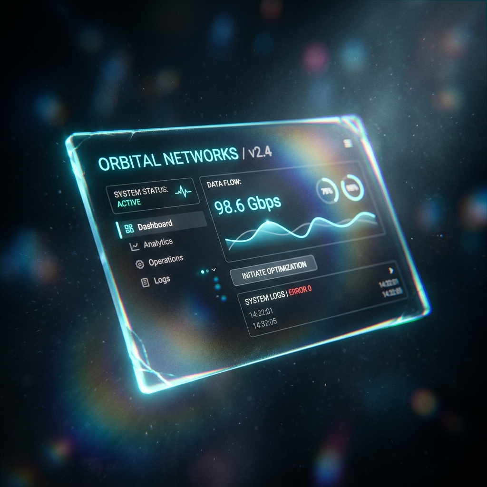

<div align="center">




# 🪞 spatial-glass-ui

**Hardware-Accelerated Zero-DOM Spatial Interfaces**

[](LICENSE)
[](https://www.typescriptlang.org/)
[]()

*Stop destroying framerates with CSS `backdrop-filter: blur()`.<br>Render true volumetric, refraction-accurate dark glassmorphism directly on the GPU.*

[The CSS Bottleneck](#the-problem-the-css-backdrop-filter-bottleneck) · [Architecture](#architecture-two-pass-spatial-rendering) · [Custom Shaders](#shader-mathematics) · [API](#api-usage)

</div>

---

## The Problem: The CSS `backdrop-filter` Bottleneck

Modern web design loves "Glassmorphism." But implementing it with standard CSS (`backdrop-filter: blur()`) is a performance disaster:
1. **GPU Thrashing:** The browser must perform an expensive multi-pass Gaussian blur on the DOM layer behind *every single glass element*. Stacking 3 glass panels? Say goodbye to 60fps on mobile.
2. **Flat Limitations:** CSS blurs are 2D. They don't refract. They don't have chromatic aberration. They don't react volumetrically to light sources (cursors).
3. **Z-Depth Illusions:** CSS 3D transforms (`translateZ`) are fake projections that don't interact with physical lighting.

### The Solution: Spatial Engine
`spatial-glass-ui` bypasses the DOM entirely for UI rendering. It treats the UI as a series of 3D planes floating in a WebGL2 frustum. It samples a background Framebuffer Object (FBO) to compute **physically accurate refraction, chromatic aberration, and Fresnel reflectance** in a single optimized pass.

---

## Architecture: Two-Pass Spatial Rendering

Instead of div tags, we use hardware quads.

```
┌────────────────────────────────────────────────────────┐
│                  spatial-glass-ui                      │
│                                                        │
│  [PASS 1: The World]                                   │
│  Render underlying 3D scene (particles, video, etc)    │
│  └─> Output to Background FBO (Texture0)               │
│                                                        │
│  [PASS 2: The Interface]                               │
│  Sort UI Panels (Back-to-Front)                        │
│  For each panel:                                       │
│    1. Calculate SDF clipping (Rounded Corners)         │
│    2. Calculate View Vector (Parallax)                 │
│    3. Offset Texture0 UVs via Normal (Refraction)      │
│    4. Apply Volumetric Lighting (Cursor distance)      │
│  └─> Output to Screen                                  │
└────────────────────────────────────────────────────────┘
```

**Zero-DOM Clipping:** Instead of CSS `border-radius`, the fragment shader uses Signed Distance Fields (SDF) to mathematically clip the fragments, ensuring zero jagged edges and perfect anti-aliasing independent of resolution.

---

## Shader Mathematics

The magic happens in `glass.frag.ts`. Here is how the physical properties are computed:

### 1. Refraction & Chromatic Aberration
We offset the screen-space UV coordinates using the perturbed surface normal to simulate the bending of light. We sample the background texture three times with slight offsets to simulate wavelength separation (Chromatic Aberration).
```glsl
vec2 refrOffset = N.xy * uRefraction;
vec2 chrOffset = N.xy * uChromaticAb;
float r = texture(uBackground, screenUv - refrOffset + chrOffset).r;
float g = texture(uBackground, screenUv - refrOffset).g;
float b = texture(uBackground, screenUv - refrOffset - chrOffset).b;
```

### 2. Fresnel Reflectance
The edges of the glass reflect more light than the center facing the camera. We use Schlick's approximation:
```glsl
float fresnel = R0 + (1.0 - R0) * pow(1.0 - max(dot(N, V), 0.0), 5.0);
```

### 3. Dynamic Volumetric Lighting
The cursor acts as a point light source in 3D space (`uLightPos`). The shader computes distance-based edge illumination and specular highlights, making the glass "glow" as the cursor hovers near it.

---

## API Usage

### 1. Installation

```bash
npm install spatial-glass-ui gl-matrix
```

### 2. Initialization

```typescript
import { SpatialEngine } from 'spatial-glass-ui';

// Initialize on a full-screen canvas
const canvas = document.getElementById('ui-canvas') as HTMLCanvasElement;
const engine = new SpatialEngine(canvas);

// Add a floating glass panel
engine.addPanel({
  x: 0, y: 0, z: 200,            // 3D position
  width: 400, height: 600,       // Dimensions
  cornerRadius: 24.0,            // SDF Border radius
  tint: [0.05, 0.07, 0.1, 0.6],  // Dark glass tint (RGBA)
  refraction: 0.15,              // Refraction intensity
  chromaticAberration: 0.08,     // RGB split intensity
  roughness: 0.3                 // Micro-bump blur amount
});

// Add another panel in front of it
engine.addPanel({
  x: -100, y: 50, z: 400,
  width: 300, height: 200,
  cornerRadius: 16.0,
  tint: [0.9, 0.0, 0.3, 0.4],    // Crimson tint
  refraction: 0.2,
  chromaticAberration: 0.1,
  roughness: 0.1
});

// Start the render loop & sensor tracking
engine.start();
```

### 3. Hardware Sensors
The engine automatically instantiates `ParallaxTracker`. 
- **Desktop:** Tracks mouse normalized device coordinates to tilt the camera and move the volumetric light.
- **Mobile:** Automatically hooks into `DeviceOrientationEvent` (Gyroscope) to tilt the UI panels based on the physical device angle.

---

## License

[MIT](LICENSE) — iKi / Frozen Flame
